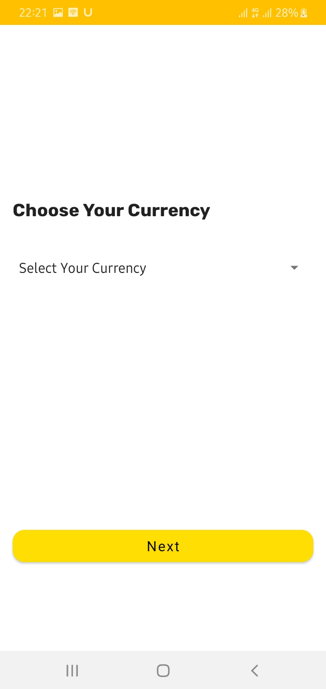
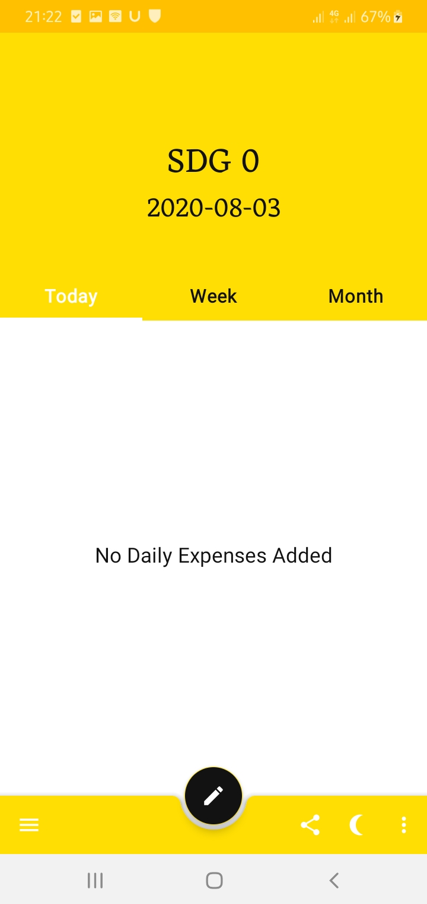
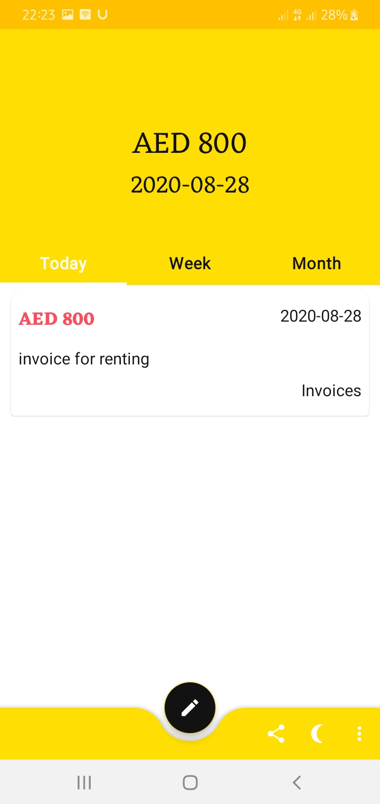
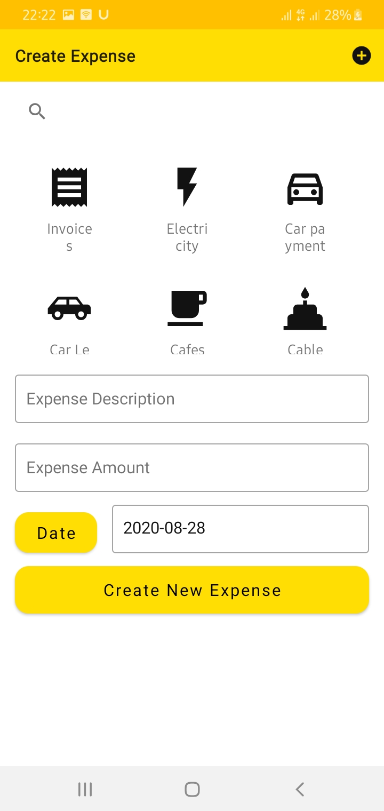
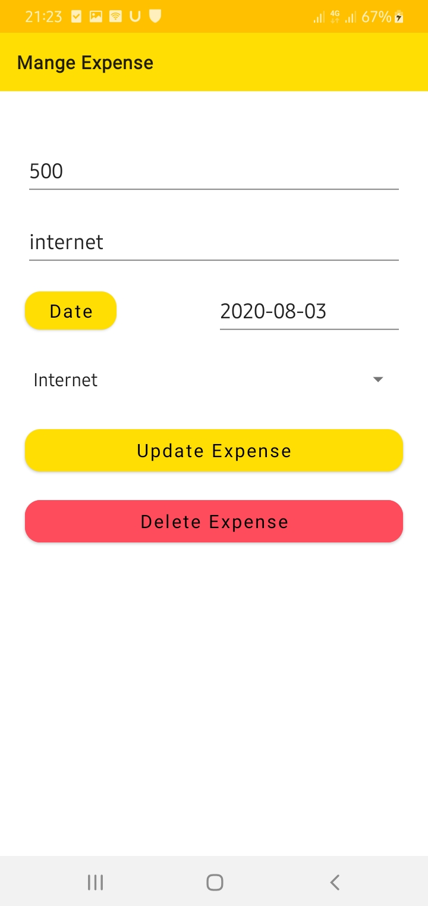
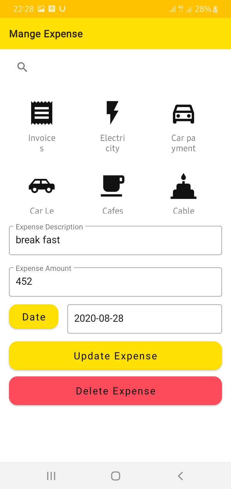
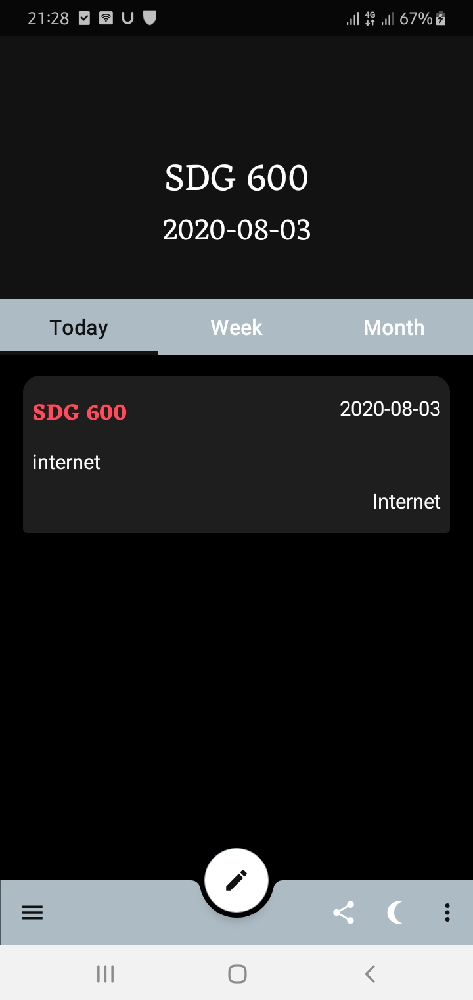

#    
     
# Expense Monitor App
        
Expense Monitor, monitors all your daily, weekly and monthly expenses and classifies them in categories using one currency or multiple currencies. 
So you can stay aware of all your expenses and where they went.

Application is available here:

## Screenshots
<table align="center">
        <tr>
          <td></td>
          <td></td>
          <td></td>
          <td></td>
        </tr>
      <tr>
        <td></td>
        <td></td>
        <td></td>
        <td></td>
      </tr>
</table> 

### Libraries used and their documentation

- Retrofit [Docs](https://square.github.io/retrofit/)
- Glide [Docs](https://bumptech.github.io/glide/)
- Moshi [Docs](https://github.com/square/moshi)
- Room [Docs](https://developer.android.com/jetpack/androidx/releases/room)
- PlayCore [DOCS](https://developer.android.com/guide/playcore)
- Preference [DOCS](https://developer.android.com/reference/android/preference/Preference)
- ViewPager2 [DOCS](https://developer.android.com/jetpack/androidx/releases/viewpager2)
- ViewModel [DOCS](https://developer.android.com/topic/libraries/architecture/viewmodel)
- Coroutines [DOCS](https://developer.android.com/kotlin/coroutines)
- Navigation [DOCS](https://developer.android.com/guide/navigation/navigation-getting-started)
- ConstraintLayout[DOCS](https://developer.android.com/reference/androidx/constraintlayout/widget/ConstraintLayout)
- Recyclerview-Selection[DOCS](https://developer.android.com/reference/kotlin/androidx/recyclerview/selection/package-summary)
- Kotlin Flow [DOCS](https://kotlinlang.org/docs/reference/coroutines/flow.html)

## Developed by
*EL TEGANI MOHAMED HAMMAD GABIR - <tiganimoh@gmail.com>
